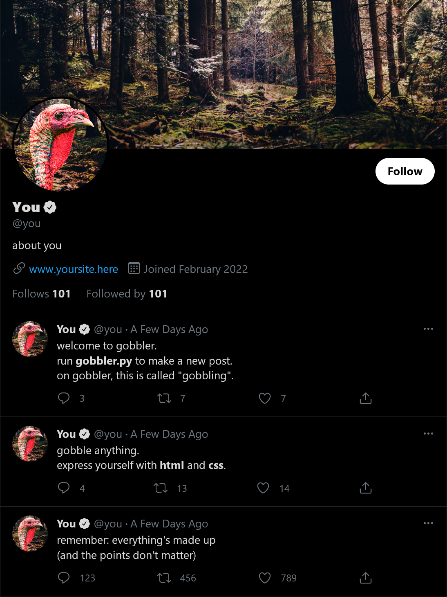

# gobbler

gobbler is a parody and protest of social media.  
use gobbler.py to compose a gobble, then open index.html to view it.  
see it in action at <a href="https://hunterirving.com/gobbler">hunterirving.com/gobbler</a>.
